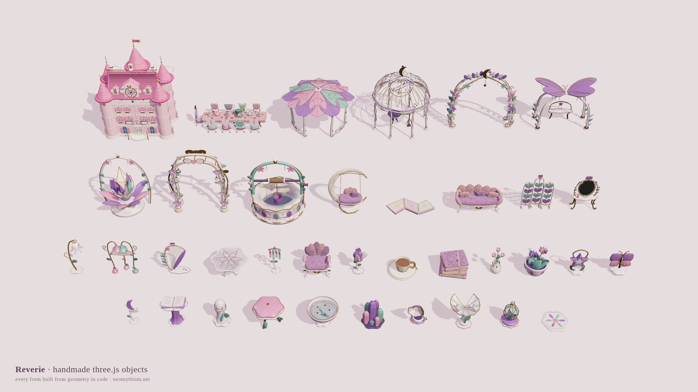

# Reverie · handmade three.js objects

The objects Reverie (neomythism.net) is furnished with, every one built from geometry in code.
No models, no game assets, no characters: 20 modules, one texture, one copy of three.js, and a
gallery page that stands all 37 objects on a sheet.



## Run it

Any static server at this folder, then open `index.html`:

    python3 -m http.server 8787

`index.html` drifts the camera slowly; `?still=1` holds it, `?caption=0` hides the caption,
`?rows=5` forces a row count (default follows the aspect ratio), `?debug=1` lists what was built.

## Use the objects

Every factory takes `THREE` as its first argument (the modules never import three themselves) and
most take the shared kit, so any three.js build works:

```js
import * as THREE from './vendor/three.module.js';
import {createFairyArchitectureKit} from './realm-fairy-architecture-kit.js';
import {buildFairyFurniture} from './realm-fairy-furniture.js';
import {buildFairyPavilion} from './realm-fairy-pavilion.js';

const kit = createFairyArchitectureKit(THREE);
const furniture = buildFairyFurniture(THREE);          // .types lists the pieces, .create(type) builds one
scene.add(furniture.create('crescentSwing'));
scene.add(buildFairyPavilion(THREE, kit));
```

| module | what it builds |
| --- | --- |
| `realm-fairy-architecture-kit.js` | shared materials, curves and the builder the architecture uses |
| `realm-fairy-finishes.js`, `realm-foundation-finishes.js` | bespoke surface finishes (nacre, satin, brocade, stonework) |
| `realm-fairy-furniture.js` | petal armchair, flower table, crescent swing, reading chaise, flower lamp, tea set, book stack, bud vase |
| `realm-fairy-small-details.js` | royal planter, starlight lantern, butterfly plaque, moonflower sign, book pedestal, pearl bollard, petal footstool, lotus wishing bowl, crystal cluster, ribbon stand, stepping stone |
| `realm-fairy-bespoke-objects.js` | butterfly dressing mirror, bluebell gramophone, wing harp, shell birdbath, petal post shrine, jewel terrarium, moonvine folding screen |
| `realm-fairy-discoveries.js` | the Butterfly Bower, the Moonpetal Wishing Well, the Crystal Bloom Shrine |
| `realm-fairy-landmarks.js` | the observatory dome and the gateway arch |
| `realm-fairy-pavilion.js`, `realm-fairy-pavilion-relief.js` | the lotus pavilion and its botanical relief |
| `realm-path-ornaments.js`, `realm-garden-paths.js` | bellflower lanterns, porcelain waymarkers, bevelled pavers |
| `realm-arrival-arbor.js` | the two-sided arrival threshold |
| `realm-tea-party-furniture.js`, `realm-tea-party-props.js` | the Unbirthday table, its nine chairs and the porcelain tea service |
| `realm-original-dollhouse.js` + `-jewels`, `-lace`, `-portal` | the pink dollhouse castle with its jewellery, lace and door |
| `realm-exact-index.js` | a geometry-indexing helper the dollhouse uses |

`assets/fairy-finishes/faerie-brocade.png` is the one texture. `vendor/three.module.js` is
three.js r170 (MIT). Everything else is original work from neomythism.net.
